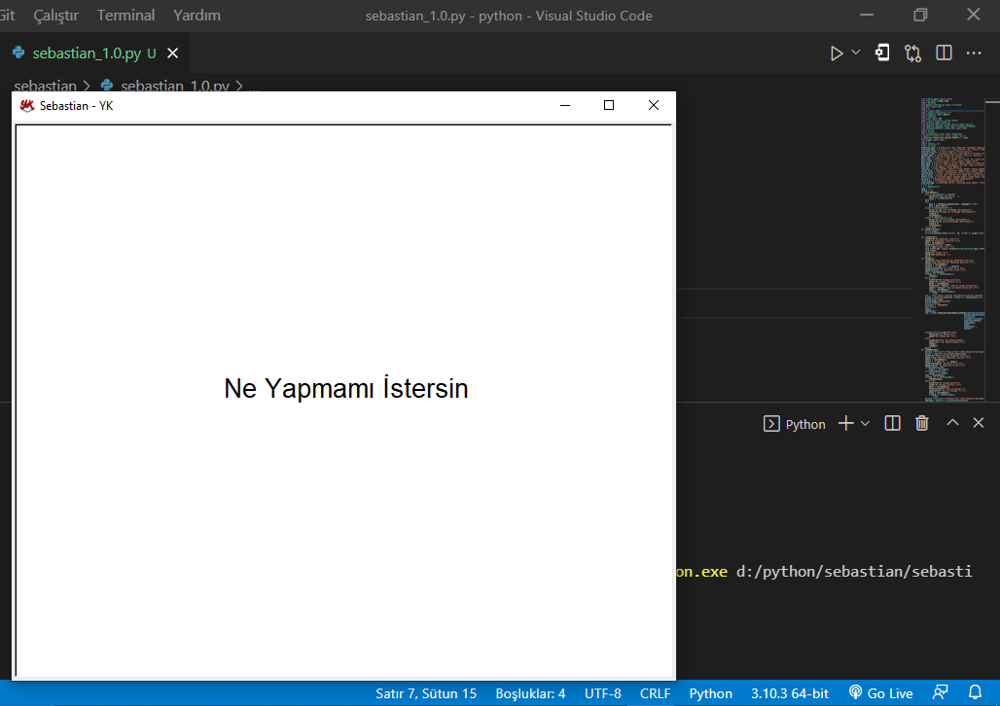
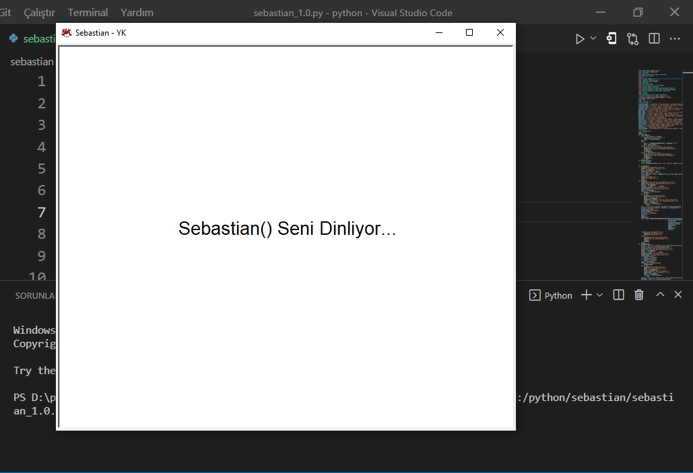
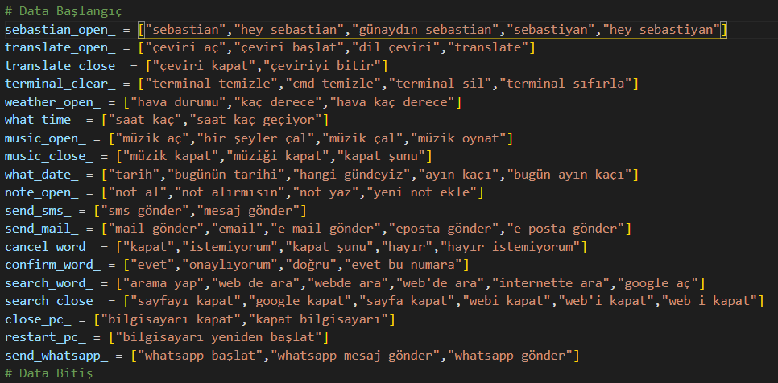

# Gelişmiş Sesli Asistan - Sebastian V1

Python dilinde çeşitli kütüphaneler kullanılarak kodlanmıştır. Metin seslendirme google'nin sağladığı kütüphane ile yapılmaktadır.

## Asistan Özellikleri

* Basit Düzeyde Arayüz Tasarımı
* Tüm İşlemler Sesli Olarak yapılabilmektedir ve Tüm işlemlerde sesli cevap alınabilmektedir
* Modül Çalıştırma için Birden fazla Sözcük Kullanılabilir
* Uyku modu ( İsmini Söylendiğinde Aktif Olur)
* Çeviri Açıldığında Türkçe Söylediğiniz cümleyi İngilizce'ye, İngilizce Söylediğiniz Cümleyi Türkçe'ye Çevirip Seslendirir, Konuşulan cümlenin hangi dil olduğunu otomatik algılamaktadır
* Terminali Temizler
* 81 İlin anlık hava durumunu söyleyebilir
* Saat'i Söyleyebilir
* Müzik ya da Sanatçı ismini söyleyerek arkaplanda müzik açabilir ve istediğiniz zaman sesli olarak müziği kapatabilir
* Söylediğiniz cümleyi not defterine gün ve saati yazarak not alabilir
* Vatansms api'sini kullanarak sms gönderebilir
* Smtp ile mail gönderebilir
* Web'de İstediğinizi aratabilir
* Bilgisayarı kapatabilir ya da Yeniden başlatabilir
* İstediğiniz numaraya whatsapp üzerinden mesaj atabilir.

# Advanced Voice Assistant - Sebastian V1

It is coded in Python using various libraries. Text vocalization is done with the library provided by google.

## Assistant Features

* Simple Interface Design
* All transactions can be made with voice and voice response can be received in all transactions.
* Multiple Words Can Be Used for Module Execution
* Sleep mode ( Activates when its name is spoken)
* When Translation is Opened, Translates and Voices the sentence you say in Turkish into English, and the sentence you say in English into Turkish, It automatically detects which language the spoken sentence is
* Cleans Terminal
* Can tell instant weather conditions of 81 provinces
* Can Tell the Clock
* You can turn on background music by saying the name of Music or Artist and turn off the music aloud whenever you want
* You can take note of the sentence you say by writing the day and time in the notebook
* Can send sms using Vatansms api
* Can send mail via smtp
* You can search what you want on the web
* Shutdown or Restart the computer
* You can send a message via whatsapp to the number you want.

## Ekran Görüntüleri - ScreenShot

 
